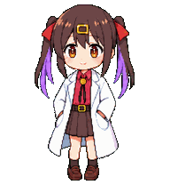

# Mihari Codex Pet

A fan-made, unofficial Codex pet inspired by Mihari Oyama from ONIMAI.

This is a non-commercial fan project for personal customization of the Codex pet overlay.

## Preview

These GIFs are generated from the final `spritesheet.webp`.

| Action | Idle | Waving | Running | Waiting | Review |
| --- | --- | --- | --- | --- | --- |
| Preview |  |  |  |  |  |

## Files

* `pet.json`
* `spritesheet.webp`
* `previews/*.gif`

## Disclaimer

This repository does not include or distribute any official ONIMAI artwork, screenshots, logos, or source assets.
All rights to ONIMAI and the original character belong to their respective rights holders.
This is an unofficial fan-made pet. If you are a rights holder and want this removed, please contact me.

## License

Code and repository text: MIT, if applicable.
Generated fan pet assets: CC BY-NC 4.0 / non-commercial fan use only.
Underlying character rights belong to their respective rights holders.
